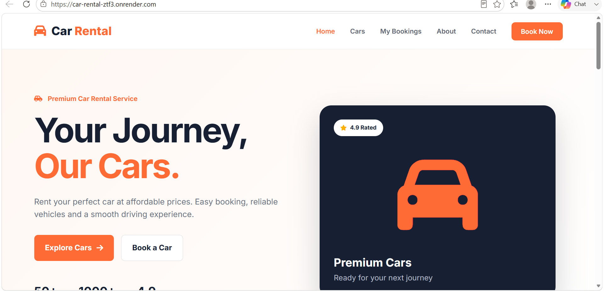
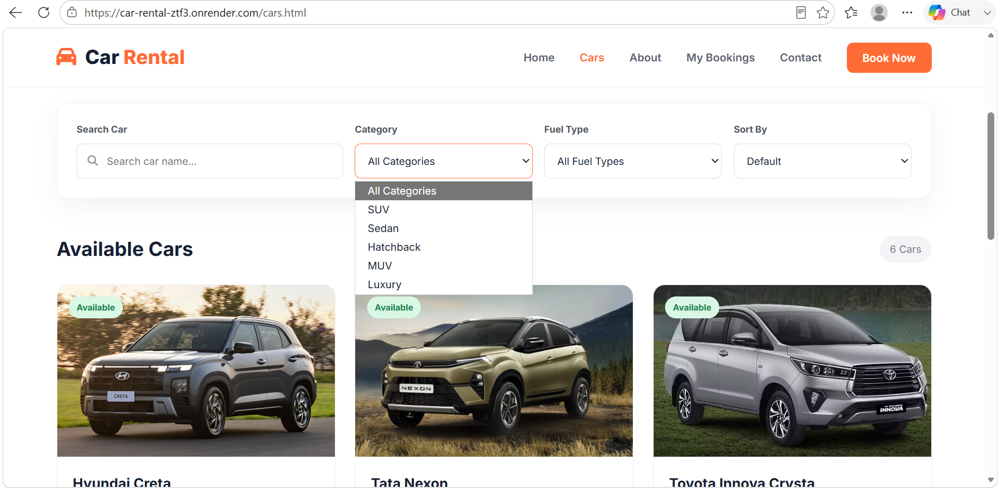
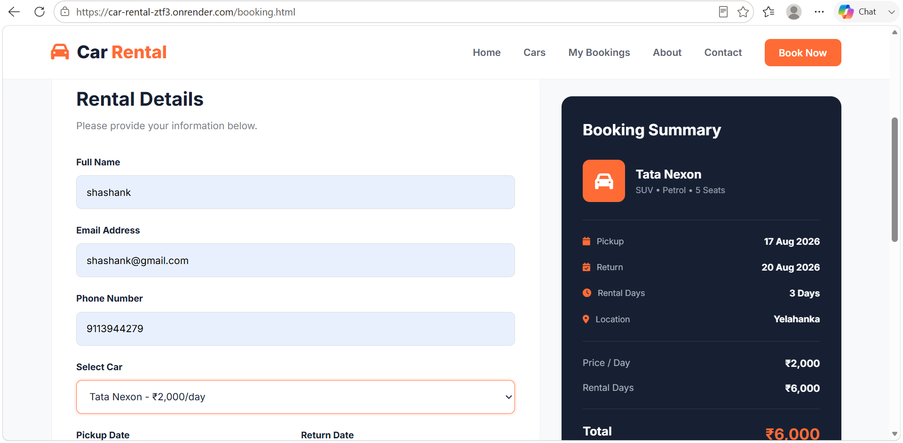
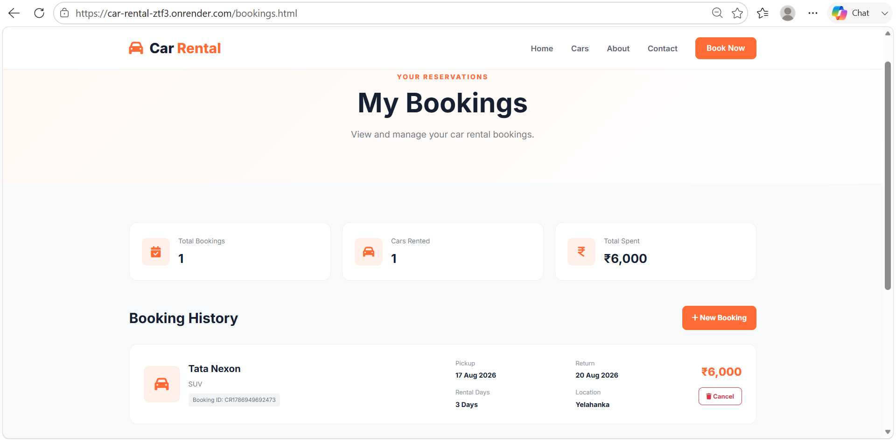
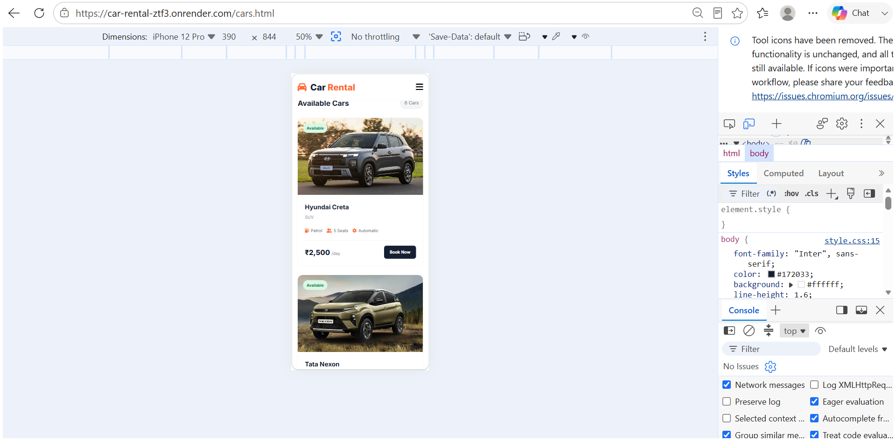

# 🚗 Car Rental Management System

A modern and responsive **Car Rental Management System** developed using HTML, CSS, and JavaScript.

This project allows users to browse available cars, search and filter cars, select rental dates, calculate rental costs, make bookings, and manage their bookings through a simple and user-friendly interface.

---

## 📌 Project Overview

The Car Rental Management System is a frontend web application designed to provide a simple online platform for renting cars.

Users can:

- View available cars
- Search cars by name
- Filter cars by category and fuel type
- Sort cars according to price
- View car details
- Select rental dates
- Calculate rental duration
- Calculate total rental cost
- Submit a booking
- View previous bookings
- Cancel bookings
- Use the website on mobile, tablet, and desktop devices

---

## ✨ Features

### 🏠 Homepage

- Attractive hero section
- Introduction to the car rental service
- Featured cars
- Call-to-action buttons
- Responsive navigation
- About section
- Contact section
- Professional footer

### 🚘 Car Listing

- Multiple car listings
- Car images
- Car name and model
- Price per day
- Fuel type
- Seating capacity
- Car category
- Availability status

### 🔎 Search and Filter

Users can:

- Search cars by name
- Filter by category
- Filter by fuel type
- Sort cars by price

### 📅 Car Booking

Users can:

- Enter customer details
- Select a car
- Select pickup date
- Select return date
- Select location
- Calculate rental days
- Calculate total rental cost
- Submit booking

### 📋 My Bookings

Users can:

- View all bookings
- View booking details
- View total bookings
- View cars rented
- View total amount spent
- Cancel bookings

### 📱 Responsive Design

The website is designed to work on:

- Desktop
- Laptop
- Tablet
- Mobile devices

---

## 🛠️ Technologies Used

| Technology | Purpose |
|------------|---------|
| HTML5 | Website structure |
| CSS3 | Styling and responsive design |
| JavaScript | Functionality and interaction |
| LocalStorage | Storing booking information |
| Font Awesome | Icons |
| Google Fonts | Typography |
| Git | Version control |
| GitHub | Source code hosting |
| Render | Website deployment |

---

## 📂 Project Structure

```text
Car-Rental/
│
├── index.html
├── cars.html
├── booking.html
├── bookings.html
│
├── css/
│   └── style.css
│
├── js/
│   ├── data.js
│   ├── main.js
│   ├── cars.js
│   ├── booking.js
│   └── bookings.js
│
├── images/
│
└── README.md


**📸 Project Screenshots**

## 📸 Screenshots

### 🏠 Homepage



### 🚘 Car Listing



### 📅 Booking Page



### 📋 My Bookings



### 📱 Mobile Responsive Design




# 🌐 Live Demo

<div align="center">

<a href="https://car-rental-ztf3.onrender.com">
  
</a>

</div>